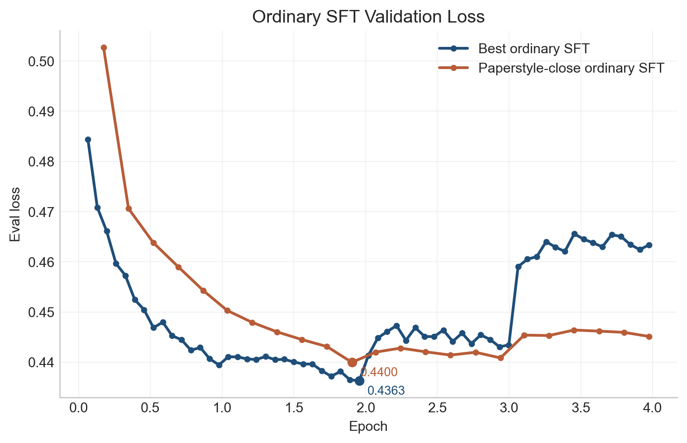
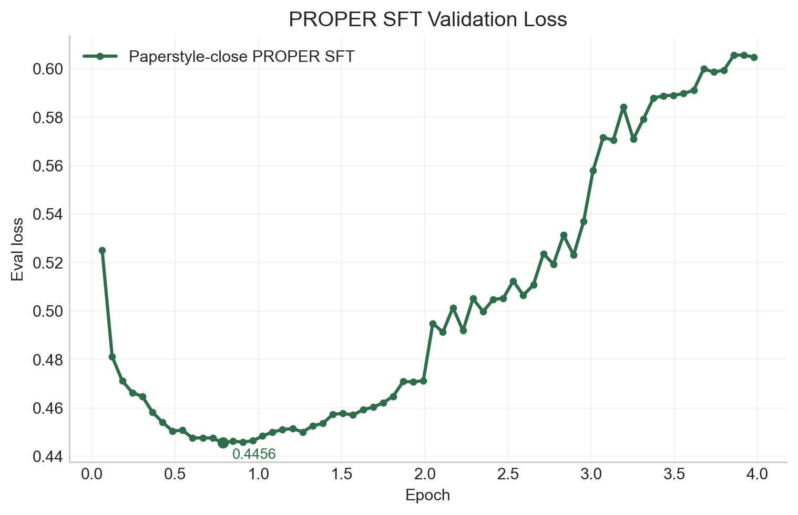
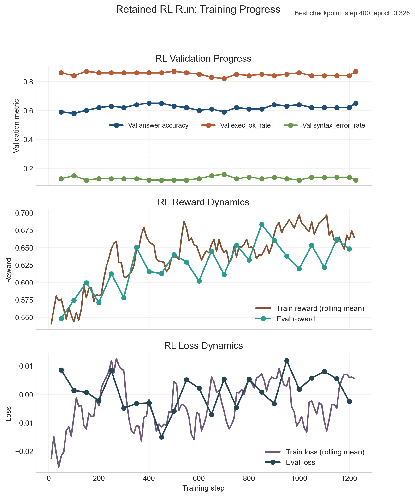

# arithmetic-reasoning-llm-prolog-repro

Independent reproduction of:
- Xiaocheng Yang, Bingsen Chen, Yik-Cheung Tam. 2024. *Arithmetic Reasoning with LLM: Prolog Generation & Permutation*. NAACL-HLT 2024 (Short), pp. 699–710. DOI: 10.18653/v1/2024.naacl-short.61
  - Paper: https://aclanthology.org/2024.naacl-short.61/

This repository is not affiliated with the paper authors.

## Reproduction Report

The full write-up for the retained experiments lives in [paper/reproduction_report.md](paper/reproduction_report.md).

## Retained Results

The table below summarizes the final held-out results for the retained SFT runs and the retained RL extension.

| Model | Evaluation split | Answer accuracy | Exec OK rate | Answer accuracy on exec OK |
| --- | --- | ---: | ---: | ---: |
| Best ordinary SFT | `gsm8k_prolog_test` | 0.5430 | 0.7871 | 0.6899 |
| Paperstyle-close ordinary SFT | `gsm8k_prolog_test` | 0.5308 | 0.7977 | 0.6654 |
| Paperstyle-close PROPER SFT | `gsm8k_proper_test` | 0.5202 | 0.7977 | 0.6520 |
| Best ordinary RL | `gsm8k_prolog_test` | 0.5871 | 0.8046 | 0.7297 |

Briefly:
- The strongest retained supervised baseline is the repo-tuned ordinary Prolog SFT run.
- The retained paperstyle-close PROPER run did not outperform the corresponding ordinary paperstyle-close SFT run in this repository.
- The retained RL extension improved over the best ordinary SFT baseline on the full `gsm8k_prolog_test` split, although the gain is modest.

## Training Dynamics

### Ordinary SFT Validation Loss



### PROPER SFT Validation Loss



### RL Training Progress



## Docker (GPU)

This project includes a CUDA-enabled Docker setup for training on Linux + NVIDIA GPUs.

### 1) Build image

```bash
docker compose build trainer
```

### 2) Start container shell

```bash
docker compose run --rm trainer
```

### 3) Run training inside container

```bash
python -m src.training.train_sft \
  --dataset-name gsm8k_proper \
  --proper-ratio 1to2 \
  --output-dir outputs/training/run2 \
  --model-name-or-path mistralai/Mistral-7B-v0.3
```

If you already have a specific prepared dataset path, use `--dataset-dir` instead of `--dataset-name`.
